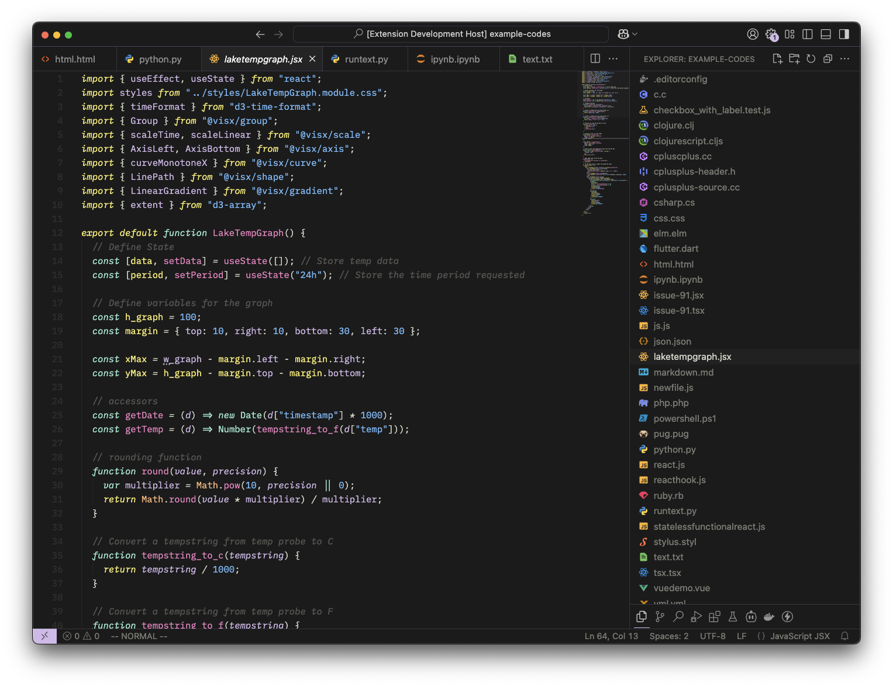
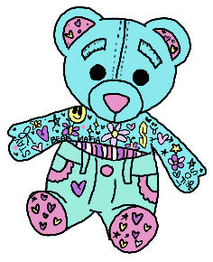

<h3>GelGel VSCode Theme</h1>

This theme makes my wife happy and if it doesn't make you happy then that is ok. Maybe check out <a href="https://marketplace.visualstudio.com/items?itemName=LanceWilhelm.horizon-extended">Horizon Extended</a> 😊

### Styles

- **GelGel** - This is all ya got for now! (see above)

**Enjoy!** ❤️
